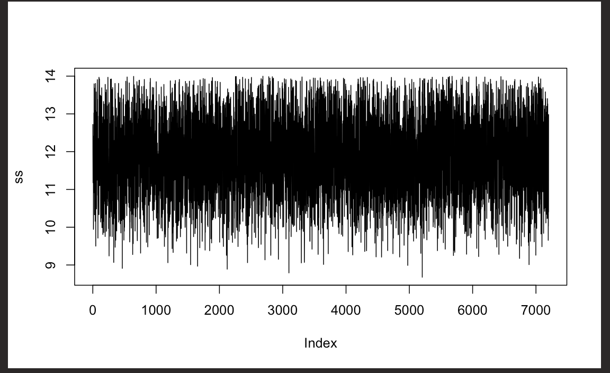

```{r setup, include=FALSE}
knitr::opts_chunk$set(echo = TRUE)
library(nimble)
library(coda)

dat <- read.table('../data/hr.dat',header=TRUE)
hr <- dat$hr
```

-----
# General Notes


# Fellingham Notes
- For Gamma distributions, prefers shape > 1 so the curve "flips over" as shown below
```{r}
curve(dgamma(x,1,.1),from=0,to=40)
curve(dgamma(x,1.1,.1),from=0,to=40,add=TRUE, col="red")
```


---- 

# Nimble Code for Heart Rate

```{r}
hrCode <- nimbleCode({
  for (i in 1:N){
    hr[i] ~ dnorm(m,sd=ss)
  }
  ss ~ dgamma(1.1,.1)
  # ss ~ dunif(0,14) # making the prior uniform creates a "haircut" posterior trace plot
  m ~ dnorm(70,10)
})

N <- length(hr)
hrData <- list(hr=hr)
hrConsts <- list(N=N)

hr.out <- nimbleMCMC(code=hrCode,
                         constants=hrConsts,
                         data=hrData,
                         nchains=4,
                         niter=10000,
                         nburnin=1000,
                         thin=5,
                         samplesAsCodaMCMC = TRUE,
                         summary=TRUE,
                         WAIC=TRUE,
                         monitors=c('m','ss'))
```

# Diagnostics
```{r}
names(hr.out)
hr.out$summary
hr.out$WAIC
```

```{r}
names(hr.out$samples)
gelman.diag(hr.out$samples) #scale reduction factor = the Rhat in stan
allsamps <- as.matrix(hr.out$samples)
dim(allsamps)
m <- allsamps[,1]
ss <- allsamps[,2]
raftery.diag(allsamps)

```
--- 
# Autocorrelation

When the autocorrelation is negative, "some of the diagnostics do funny things" like where the effective size is greater than the number of samples. (This isn't the case here as shown below).
```{r}
autocorr.diag(as.mcmc(allsamps))

effectiveSize(as.mcmc(allsamps))
```

# Posterior Summary Statistics
```{r}
summary(m)
quantile(m, c(.025,.975)) # 95% credible interval for m

summary(ss)
quantile(ss, c(.025,.975)) # 95% credible interval for ss

```


# Plots
```{r}
plot(density(m,adjust=2))
plot(density(ss,adjust=2))
plot(m,type='l')
plot(ss,type='l')

```



# Coeffecient of Variation
A ratio of the standard deviation to the mean.
```{r}
cv <- ss/m
summary(cv)
plot(density(cv,adjust=2))
```


